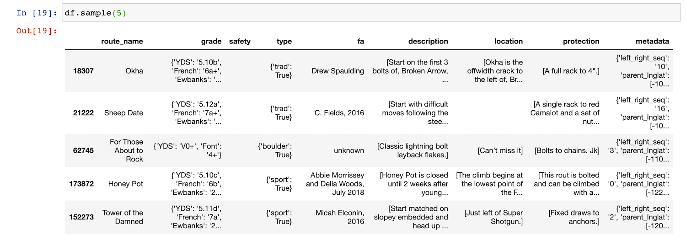

<p align="center">
   <a href="https://openbeta.io" rel="nofollow"></a>
</p>
<h1 align="center">OpenBeta</h1>
---
<h3 align="center">Open source rock climbing data</h3>

## User ratings
[User ratings](./ratings) extracted from MountainProject.

---

## USA climbing routes data

Climbing routes extracted from MountainProject.

## File format
Data files are in jsonlines format. 

A sample record: ([raw file](./epinephrine-sample.jsonlines))

```json
{
   "route_name":"Epinephrine",
   "grade":{
      "YDS":"5.9",
      "French":"5c",
      "Ewbanks":"17",
      "UIAA":"VI",
      "ZA":"17",
      "British":"HVS 5a"
   },
   "safety":"",
   "type":{
      "trad":true
   },
   "fa":"Jorge Urioste, Joanne Urioste, Joe Herbst, 1978",
   "description":[
      "This is it. THE classic red rocks route. And it's just as good as everyone says it is.",
      "",
      "Approach as for the Black Velvet wall. After climbing around the chockstone, return to the stream bed and walk another minute or two upstream. The bolts on the first pitch will be easily spotted on the left.",
      "",
      "This route has lost some of the original seriousness now that bolted anchors have been placed all the way up. This speeds things up considerably and provides an easy retreat if needed. You'll need two ropes if you intend to rap the route.",
      ""
   ],
   "location":"",
   "protection":[
      "You don't need anything bigger than a #4 camalot in the chimney pitches. A 3, 3.5, and 4 camalot and perhaps a #11 hex, combined with the existing fixed gear, should get you up the chimney without much mental stress."
   ],
   "metadata":{
      "left_right_seq":"23",
      "parent_lnglat":[
         -115.46652,
         36.03518
      ],
      "parent_sector":"Black Velvet Wall",
      "mp_route_id":"105732422",
      "mp_sector_id":"105732162"
   }
}
```

## How to work with the data
We recommend using Jupyter notebook and Pandas to work with the dataset.  For a more complete example, check out our [Pandas 101 tutorial](https://openbeta.substack.com/p/pandas-101-visualize-usa-rock-climbing).

```python
import pandas as pd

# load the zip file directly
# 'lines=True' indicates jsonlines format
df = pd.read_json("/Users/nacho/git/opendata/openbeta-usa-routes-aug-2020.zip", lines=True)

df.sample(5)
```



## Questions or Comments?
[data@openbeta.io](mailto:data@openbeta.io)