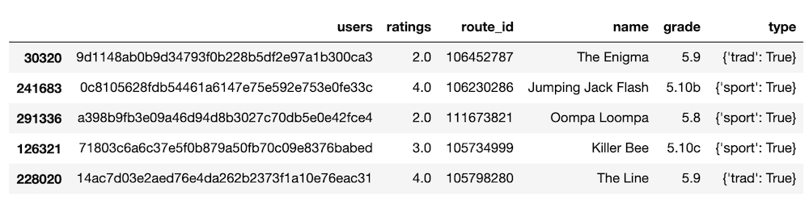

## User ratings

Load data with Python Pandas

```
import pandas as pd
import numpy as np

df = pd.read_csv("ca-ratings.csv.zip", compression="zip")
df.sample(5)
```




## Tutorials
- [How to build a climbing route recommendation engine](https://openbeta.substack.com/p/building-a-climbing-route-recommendation)